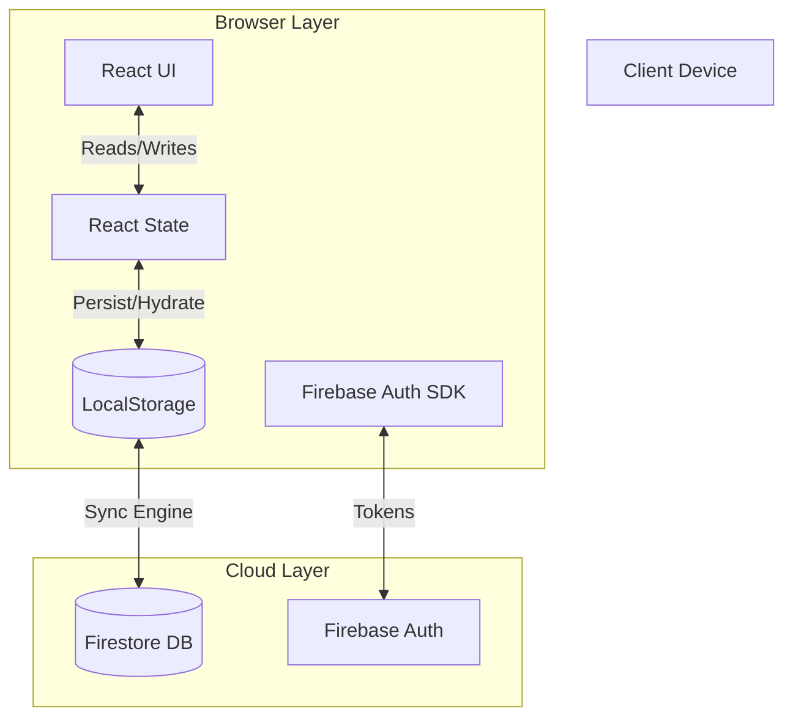
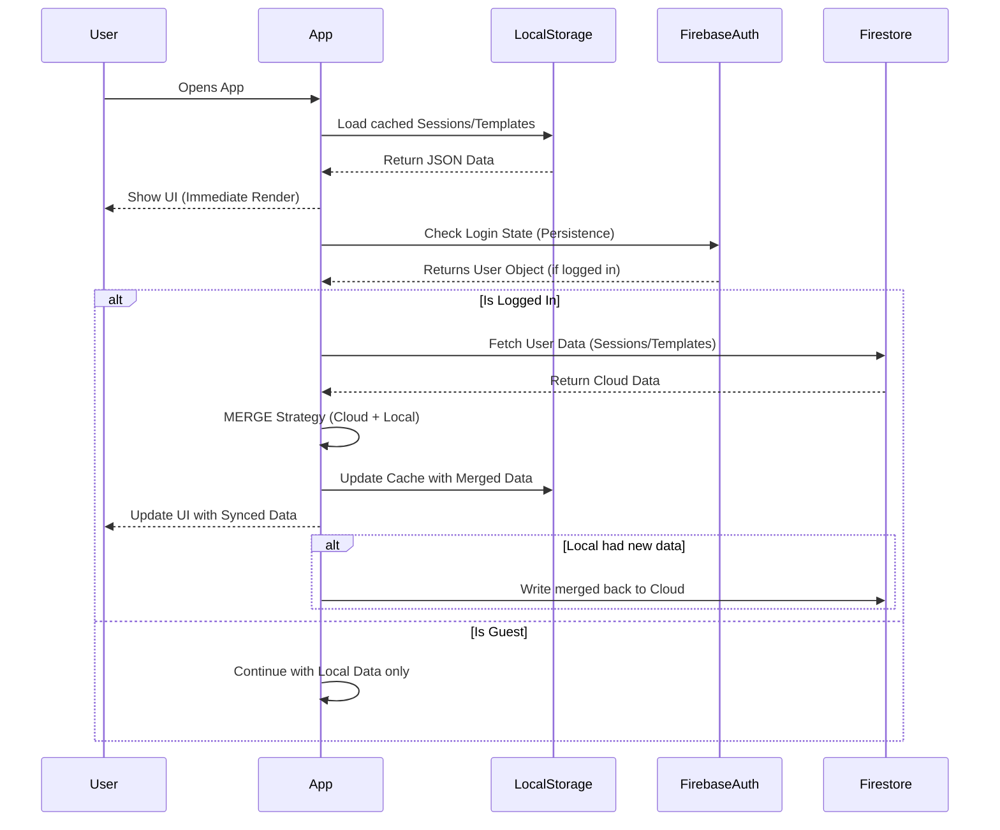
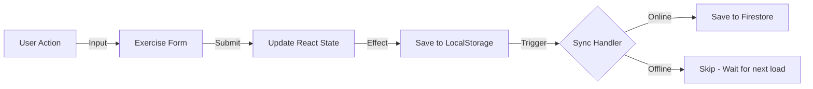
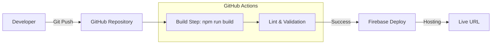

# System Design Flow - IronTrack

This document details the architectural flows for the IronTrack application, focusing on Data Synchronization, User Interaction, and Logic Control.

## 1. High-Level Architecture
IronTrack operates on a **Local-First, Cloud-Assist** architecture. The application is fully functional offline, using the browser's LocalStorage as the primary data source. When online, it synchronizes with Firebase Firestore.

---

## 2. Authentication & Initialization Flow
This flow ensures the user is recognized and their data is loaded without blocking the UI.

---

## 3. Workout Session Data Flow
How data moves when a user logs a workout.

**Conflict Resolution Strategy:**
*   **Create**: Random UUIDs generate unique IDs for every session/exercise, preventing ID collisions.
*   **Update**: "Last Write Wins" for individual fields, but the Merge Logic in `storage.js` prioritizes Union of data sets (keeping items that exist in one but not the other).

---

## 4. Deployment Pipeline (CI/CD)
How code gets from your machine to the live URL.

