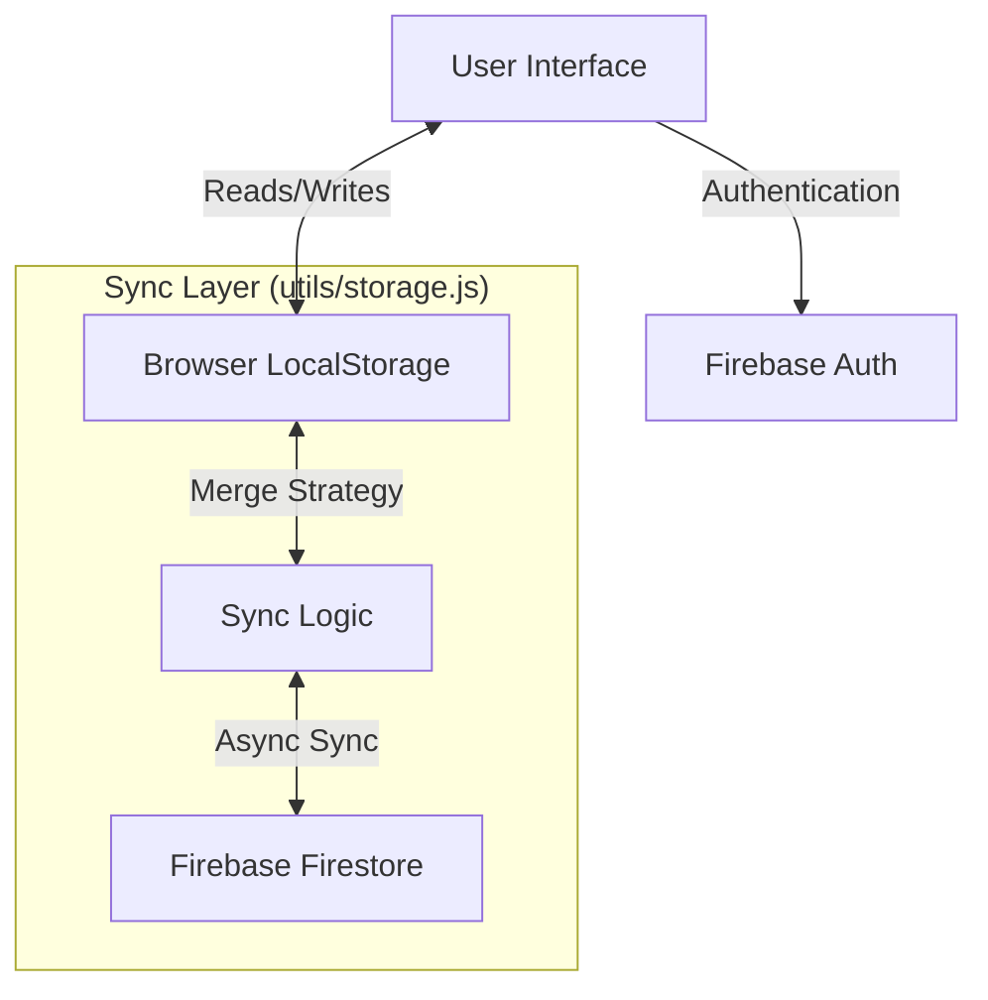

# Technical Documentation: IronTrack Gym Tracker

## 1. Project Overview
**IronTrack** is a modern, responsive web application designed for tracking gym workouts. It solves the problem of manual workout logging by providing a digital interface to record exercises, sets, reps, and weights. 

The core philosophy of the application is **"Offline-First, Cloud-Synced"**. Users can log workouts seamlessly without an internet connection, and data synchronizes to the cloud when online, ensuring reliability in gym environments where connectivity is often poor.

---

## 2. Technology Stack & Rationale

| Layer | Technology | Version | Reasoning |
| :--- | :--- | :--- | :--- |
| **Frontend** | **React** | 19.x | Component-based architecture allows for a modular, reusable UI (e.g., `ExerciseForm`, `SessionHistory`). The vast ecosystem and `useEffect`/`useState` hooks make state management intuitive. |
| **Build Tool** | **Vite** | 7.x | Chosen for superior development experience (HMR) and fast build times compared to Webpack. Essential for a quick feedback loop. |
| **Language** | **JavaScript (ES6+)** | - | Universal web standard. (Note: A TypeScript migration would be a recommended upgrade for type safety). |
| **Backend / DB** | **Firebase** | 12.x | **Authentication**: Google Sign-In provides secure, passwordless entry.<br>**Firestore**: NoSQL cloud database fits the hierarchical data structure (User -> Sessions -> Exercises) perfectly.<br>**Hosting**: Global CDN for fast content delivery. |
| **Local Storage** | **Browser LocalStorage** | - | Acts as the immediate "cache" for user data, enabling the offline-first experience. |
| **CI/CD** | **GitHub Actions** | - | Automates the deployment pipeline. Any push to `main` triggers a build and deploy to Firebase Hosting. |
| **Styling** | **Vanilla CSS (Variables)** | - | CSS Variables (`var(--primary-color)`) provide a lightweight theming engine (Dark Mode) without the overhead of a heavy UI framework. |

---

## 3. System Design & Architecture

The application uses a **Hybrid Sync Architecture**.

### High-Level Architecture Diagram


### Data Flow Strategy
1.  **Read Path**: The app *always* reads from `LocalStorage` first to render the UI instantly. This ensures zero latency.
2.  **Write Path**: User actions (e.g., "Save Session") write immediately to `LocalStorage`.
3.  **Sync Path**: 
    - **On Load**: The app fetches Cloud data, compares it with Local data, merges any differences (preserving local-only changes), and updates both LocalStorage and the Cloud.
    - **On Save**: If the user is online, data is pushed to Firestore asynchronously after the local write.

---

## 4. Advantages & Disadvantages

### Advantages
*   **Zero Latency UI**: Because the UI relies on LocalStorage, interactions feel native and instant.
*   **Resilience**: Works perfectly in gym basements with no signal.
*   **Low Cost**: Hosting and Database are effectively free for thousands of users via Firebase's generous free tier.
*   **Simplicity**: No complex dedicated backend server to maintain (Serverless).

### Disadvantages
*   **Client-Side Heavy**: As history grows (e.g., 5 years of data), loading the entire JSON blob into LocalStorage and memory will cause performance issues.
*   **Conflict Resolution**: The current sync strategy is "Merge", but complex conflict scenarios (editing the same session on two devices simultaneously) might result in minor data anomalies.
*   **Security**: While Firebase Rules protect the DB, storing sensitive data in LocalStorage makes it accessible if the device is compromised (though standard for this type of app).

---

## 5. Scalability & Future Upgrades

### How to Scale
1.  **Pagination**: Instead of `getSessions()` loading *everything*, implement `getSessions(limit=20, offset=0)` in Firestore and remove dependence on full LocalStorage for history.
2.  **Edge Caching**: Use Firebase Hosting's CDN to cache static assets close to users globally.
3.  **Backend Migration**: If business logic becomes complex (e.g., AI coaching, social feeds), move logic from Client -> Firebase Functions (Serverless).

### Recommended Improvements (Roadmap)
1.  **PWA (Progressive Web App)**: Add a `manifest.json` and Service Workers. This will allow users to **install** the app on their home screen, making it indistinguishable from a native app.
2.  **Analytics Dashboard**: use a library like `Recharts` to visualize "Bench Press Progress over Time" or "Volume per Week".
3.  **Social Features**: "Friend Feed" where users can see workouts logged by friends (requires a new Data Collection in Firestore: `friendships`).
4.  **TypeScript Migration**: Rewrite `.jsx` files to `.tsx` to catch bugs at compile time, especially for the Data Models (`Session`, `Exercise`, `Set`).
5.  **State Management**: Move from `useState` + `LocalStorage` custom hooks to **TanStack Query (React Query)** or **Redux Toolkit** for more robust cache management.

---

## 6. Directory Structure
```
/src
├── components/       # Reusable UI blocks (ExerciseForm, Header, etc.)
├── utils/            # Core logic (Firebase config, Storage/Sync engine)
├── assets/           # Images and static files
├── App.jsx           # Main Application Controller
└── main.jsx          # Entry point
```
